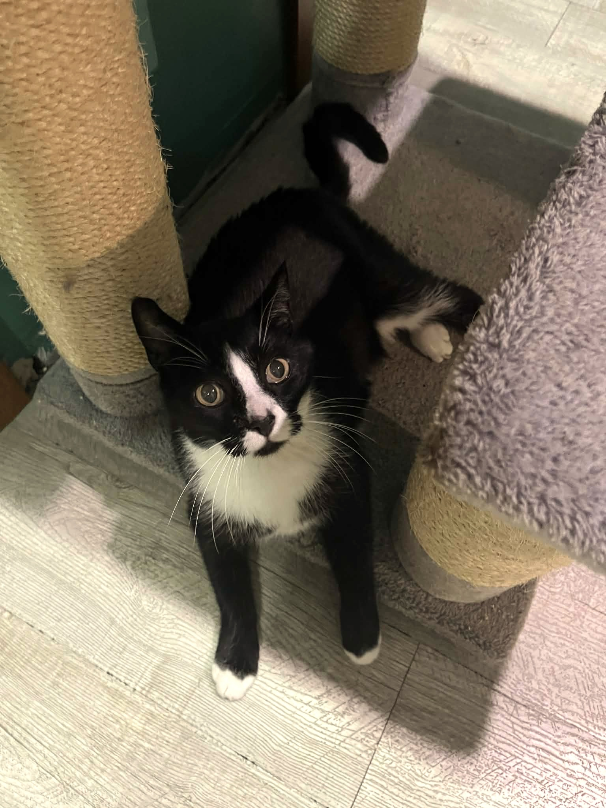
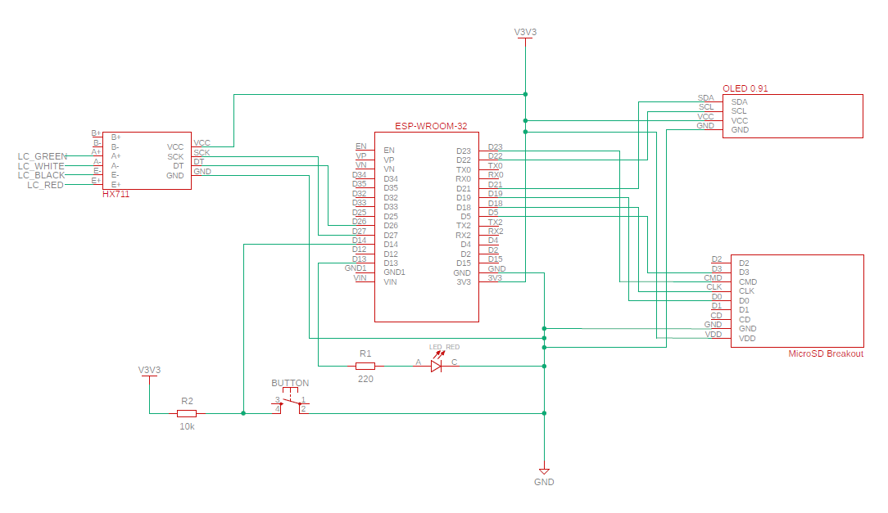
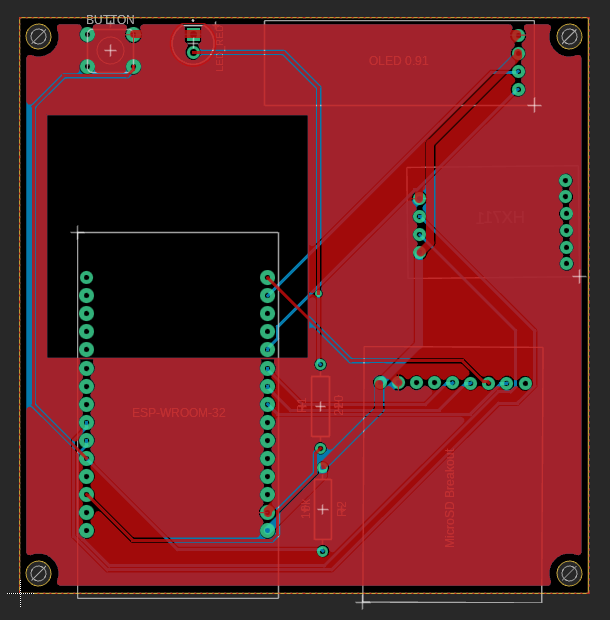

# 🐾 Pet Appetite Monitor
## A smart scale for precise tracking of pet food intake.

## 🐈‍⬛ Project Origins

This handsome gentleman is **Zefir**.
We've known each other for 15 years, which is more than half of my life. 
Recently, he was diagnosed with intestinal lymphoma. 
A crucial part of his care involves monitoring his food intake, both daily and weekly, to track his appetite and overall well-being.
This need became an inspiration for this project and unfortunately the only way I can help him.
 

## 🛠️ How it works
The primary purpose is to monitor and record the time and quantity of a pet's meals, providing data to help manage their condition. The data is stored locally on a MicroSD card and also sent to **Firebase**, from where it is retrieved by a mobile app [Bon TrackPETite](https://github.com/emillia-q/bon-trackpetite.git). 
WiFi access is required for a successful startup to synchronize the internal clock with an NTP server. After configuration, when the display starts showing the weight, the user can place a bowl on the scale. After taring the scale and filling the bowl, the monitoring program can be initiated. **Every ten minutes**, the scale checks if the weight has dropped and if a decrease is detected the data is automatically saved. 

---

## 📐 Architecture & Hardware
The project is built on **ESP32-WROOM** platform and developed using PlatformIO.
### Schematic Preview
| Schematic | PCB (Top, Bottom & GND) |
| :---: | :---: |
|  |  |
| [📄 View full PDF](./hardware/schematics/Schematic.pdf) | [📄 View full PDF](./hardware/schematics/PCB.pdf) |

### Components Used
* **HX711 & Load Cell:** Measures weight and converts the analog signal to digital data.
* **OLED 0.91' Display:** Shows the current weight and system status (e.g. SD card errors) via the **I2C communication protocol**.
* **MicroSD Breakout & MicroSD card:** Used for data logging via the SPI interface. The system manages two specific files:
  * **`/data_log.txt`**: A permanent archive of all recorded measurements.
  * **`/backup_log.txt`**: Stores data that couldn't be sent to Firebase due to connection issues. This file is cleared once the WiFi connection is restored and the data is successfully synced.
* **Red LED:** Provides visual feedback for user commands:
  * One long flash: The scale has been successfully tared.
  * Three short flashes: The monitoring program is active and measuring.
* **Tact Switch Button:** Allows the user to interact with the device:
  * One short press: Tares the scale.
  * 3-second long press: Starts monitoring the meal.
 
## ⚙️ Key Features & Implementation
* **Weight Stabilization:**
   * **Median Filter:** To eliminate random noise and signal spikes by sorting the last 5 samples.
   * **EMA (Exponential Moving Average):** Smoothing the result so that the weight changes on the display are smooth.
   * **Hysteresis Logic:** To prevent display flickering and ensure stable readings.
* **Data Integrity & Persistence:**
  * Data is stored locally on a MicroSD via **SPI** and synced to **Firebase**.
  * If WiFi connection is lost, the data is saved in a local backup file and automatically synchronized once the connection is restored.
* **Hardware Persistence:**
   Uses **ESP32 Non-Volatile Storage (NVS)** via the Preferences library to store calibration factor, so it doesn't need to be recalibrated each time in setup.
* **Reliable Timekeeping:**
  Internal **RTC** that synchronizes with **NTP servers**. To prevent time drift, the device performs a scheduled daily re-synchronization at 3:00 AM.
* **Empty Bowl Detection:**
  The program automatically stops the monitoring cycle when it detects that the bowl is empty (weight <= 2g), saving system resources. Also, if the bowl is empty, the device **ignores the start button** to prevent accidental monitoring of an empty bowl. This ensures the user **correctly fills the bowl** before starting a cycle, avoiding unnecessary resets or wait times.
* **Deep Sleep:**
  To lower power consumption, the device enters deep sleep mode when the bowl is considered empty after a meal or after 5 minutes of no activity (when the scale is in standby mode after powering on the device).

---

## 🪚 Build Process
If you are interested how the build process went and what the project looks like "under the hood", you can check out the [Behind the Scenes](./assets/behind-the-scenes) folder.

---

## 👩‍💻 Author
**Emilia Kura**
   
